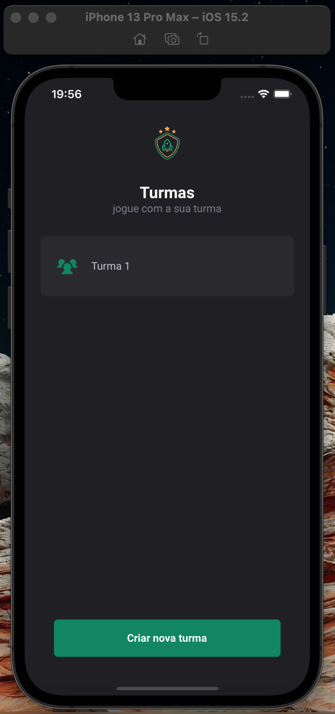
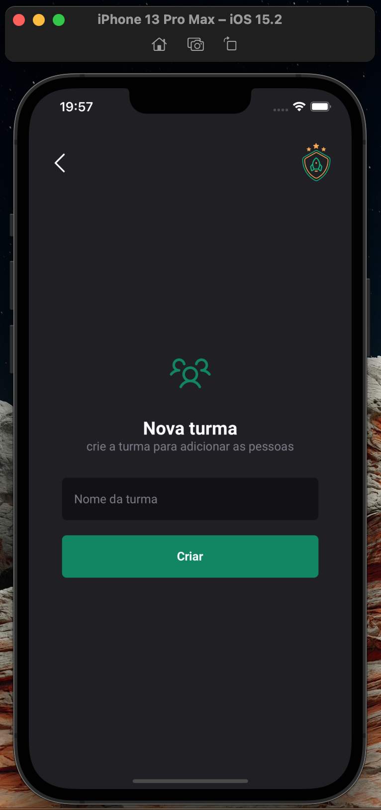
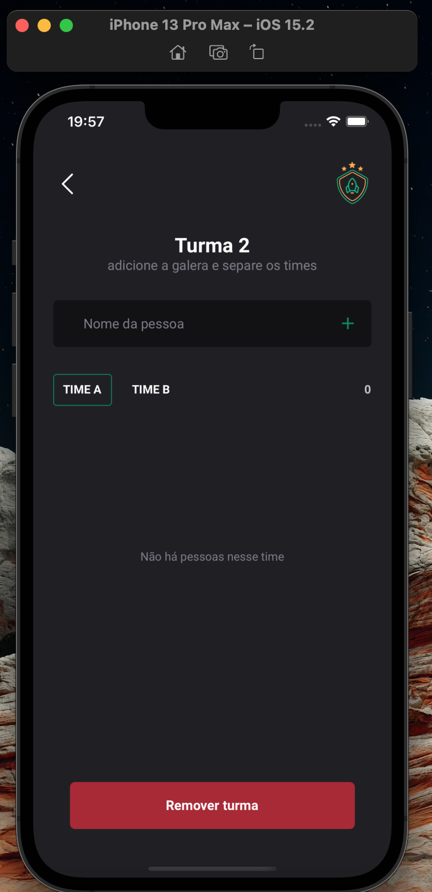
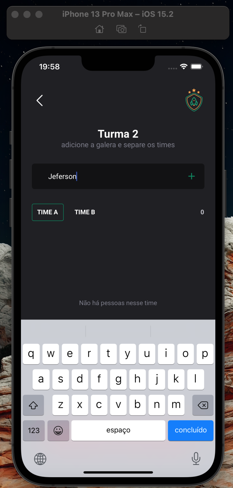
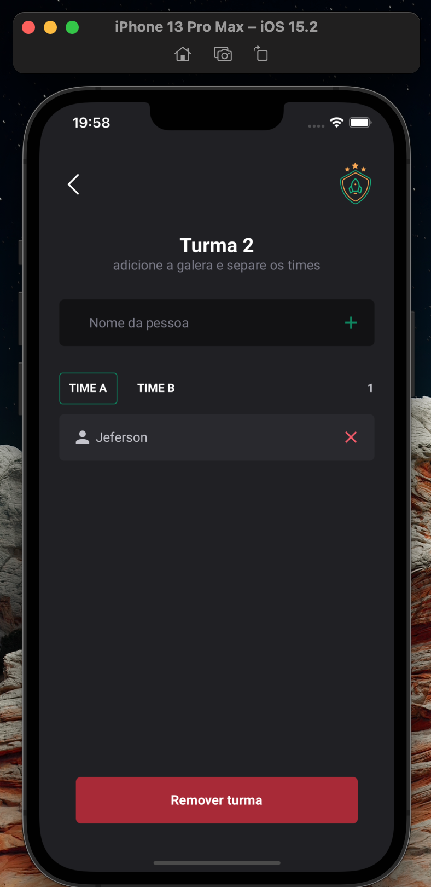
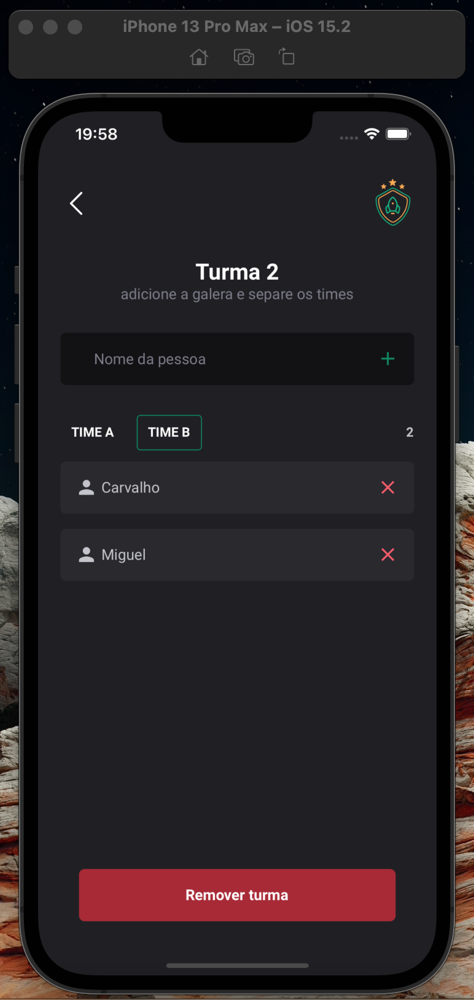
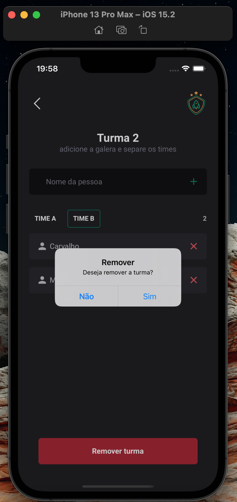
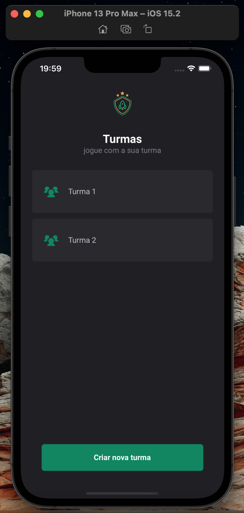

# Teams App - React Native

<p align="center">
  
</p>

## Description

Teams is a React Native app built using Expo, which allows users to create and manage multiple class teams, and add people to each team (Team A and Team B). Users can also delete people and teams.

## Installation

To install and run the app locally, please follow these steps:

Clone the repository: 

```bash
git clone https://github.com/jefersonwillian/iginite-rn-02-teams.git
```

Enter the project folder:

```bash
 cd iginite-rn-02-teams.git
```
Install the dependencies:

```bash
npm install
```

Start the development server:

```bash
expo start
```

Run the app on an emulator or physical device using one of the following commands:
Follow the instructions in the Expo Developer Tools to run the app on an emulator or physical device.

```bash
expo android
```

or

```bash
expo ios
```

## Usage

When the app is running, you will be presented with a list of classes that have been added. To create a new class, click the "Add Class" button in the top-right corner of the screen. This will take you to a new screen where you can create a class by entering its name.

After creating a class, you will be redirected to another screen where you can manage its teams. Here you can add people to either Team A or Team B, and delete them if necessary. You can also delete the class by clicking the "Delete Class" button at the bottom of the screen.

To delete a person from a team, simply click the "X" icon next to their name.

## Screens

<p align="center">
    
    
    
</p>

<p align="center">
    
    
    
</p>

<p align="center">
    
    
</p>


## Contributing

If you would like to contribute to this project, please open an issue or submit a pull request. All contributions are welcome!

## License

This project is licensed under the MIT license. See the LICENSE file for more details.

## Author

`Teams App` was developed by Jeferson Carvalho.
